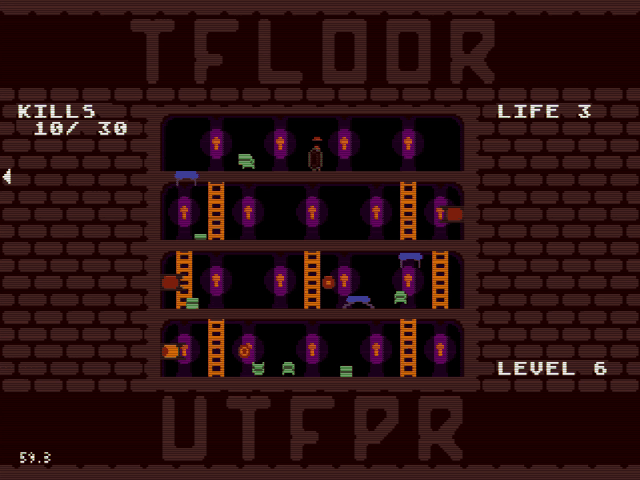
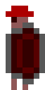
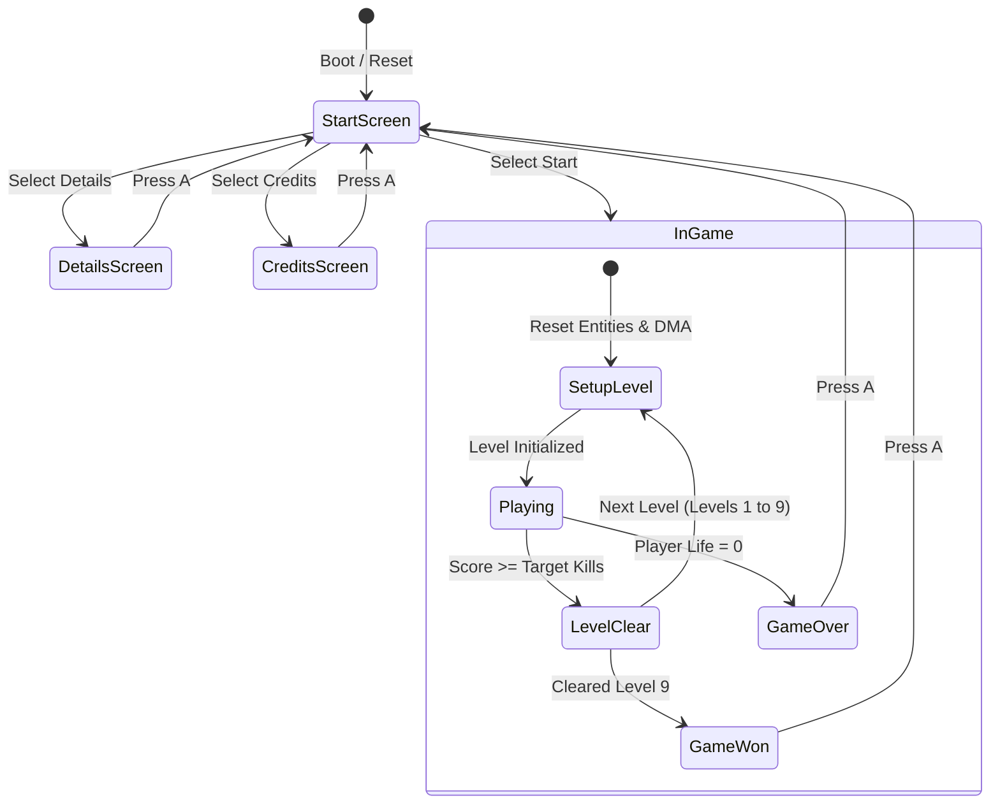
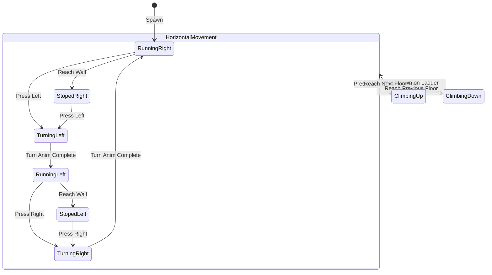
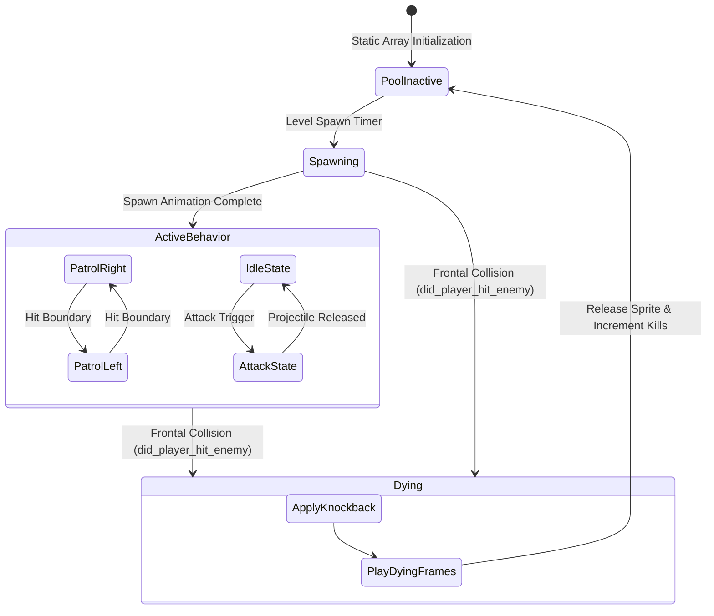

# Tfloor

A 16-bit action tower-climber homebrew developed in **C** for the **Sega Mega Drive / Genesis** using the **SGDK** (Sega Genesis Development Kit). Created as an academic project for the Legacy Computer Systems course.

<div align="center">
  
  <p><em>Real 16-bit gameplay footage (Level 6) showing floor transitions, multi-enemy waves, and combat.</em></p>
</div>

---

## Overview

**Tfloor** challenges players to ascend a vertical brick tower divided into four distinct floors connected by ladders. To clear each stage, the player must defeat a quota of hostile creatures without getting overwhelmed.

Combat is purely physical and directional: dashing head-on into an enemy eliminates the target, while contact from behind or taking unshielded projectile damage depletes player life.

### Key Highlights

- **Target Hardware:** Sega Mega Drive / Genesis (Motorola 68000 CPU @ 7.6 MHz, VDP, Z80 audio coprocessor).
- **Toolchain:** SGDK 2.0+ with modern C development workflow.
- **Audio:** Native XGM2 sound driver supporting dual-channel PCM digital sound effects alongside FM/PSG synthesized tracks.
- **Performance Constraints:** Zero dynamic memory allocation (`malloc` free), fixed object pooling, and 16-bit fixed-point math (`fix16`) optimized for CPUs without floating-point units.

---

## Entities & Enemies

| Entity | Preview | Type | Description |
| :--- | :---: | :--- | :--- |
| **Player** |  | Protagonist | Armored runner. Navigates floors, climbs ladders, and tackles targets with forward shield attacks. |
| **Slime** |  | Ground Patrol | Patrols floors horizontally, reversing direction on borders. Vulnerable to frontal tackle. |
| **Bat** |  | Aerial Patrol | Airborne unit fluttering across the arena, harassing the player during climbs. |
| **Horizontal Shooter** |  | Ranged Enemy | Charges and shoots linear projectile spheres horizontally across the floor. |
| **Vertical Shooter** |  | Ranged Turret | Fixed ground cannon that fires projectiles upward through upper floor gaps. |
| **Teleporter** |  | Ambush Enemy | Materializes near the player after a warning charge phase, requiring quick reflexes. |
| **Jumper** |  | Mobile Enemy | Leaps vertically between floors with high trajectory jumps. |
| **Projectile** |  | Hazard | Energy spheres discharged by ranged shooters. Causes damage on contact. |
| **Heart Item** |  | Collectible | Spawns periodically with a limited lifespan. Restores 1 life point upon pickup. |

> [!TIP]
> Individual frame animations for each entity state (climbing, turning, dying, shooting) can be inspected in the [`gifs/`](gifs/) directory or regenerated using [`scripts/generate_gifs.py`](scripts/generate_gifs.py).

---

## Architecture & State Machines

The codebase is built on finite state machines (FSM) to ensure deterministic frame budgets and smooth 60 FPS execution on the Motorola 68000.

### 1. Game Flow & Screen Manager

Controls game phases, level setup, win/loss conditions, and screen transitions:



### 2. Player Controller FSM

Governs movement physics, direction transitions, and ladder alignment:



### 3. Enemy Lifecycle & Object Pool FSM

Enemies reside in static arrays and transition through a non-allocating lifecycle:



---

## Technical Implementation Details

- **Fixed-Point Arithmetic:** Movement and trajectory calculations use SGDK's `fix16` integer representation (`FIX16(0.9)`, `fix16ToInt`) to bypass software floating-point emulation overhead on the 68000.
- **Zero-Allocation Pools:** Dynamic heap allocation is prohibited to avoid fragmentation in the console's 64 KB RAM. Actors are managed through static pools (e.g., `_slime_list[16]`, `_bat_list[5]`) with recycling flags.
- **VDP Plane Management:**
  - `BG_A`: Arena background architecture (`cenario.png`).
  - `BG_B`: Non-destructive HUD text layer (`KILLS`, `LIFE`, `LEVEL`) and menu overlays.
  - `Sprite Engine`: Hardware sprite multiplexing with automatic DMA transfers.
- **XGM2 Audio Subsystem:** Background music tracks run as `.vgm` sequences while digital sound effects (`sfx_hit_effect`, `sfx_option_effect`, `sfx_stairs_effect`) execute via PCM playback over reserved channels (`CH2`, `CH3`).

---

## Controls

| Joypad Input | In-Game Action | Menu Action |
| :--- | :--- | :--- |
| **D-Pad Left / Right** | Turn and run across the floor | — |
| **D-Pad Up / Down** | Climb ladders between floors | Select menu option |
| **Button A** | Confirm / Accept | Confirm selection |
| **Start** | Pause | Start game |

---

## Building and Running

### Prerequisites

1. **SGDK:** Download and extract [SGDK](https://github.com/Stephane-D/SGDK) (version 2.00 or newer recommended).
2. **Environment Variable:** Set `GDK` pointing to your SGDK directory (e.g. `C:/dev/sgdk` or `/opt/sgdk`).
3. **Editor:** [Visual Studio Code](https://code.visualstudio.com/).
4. **VS Code Extensions:**
   - [Genesis Code](https://marketplace.visualstudio.com/items?itemName=zerasul.genesis-code)
   - [C/C++ for Visual Studio Code](https://marketplace.visualstudio.com/items?itemName=ms-vscode.cpptools)
5. **Emulator:** [BlastEm](https://www.retrodev.com/blastem/) or [Gens](https://segaretro.org/Gens).

### Build Instructions

#### Using VS Code + Genesis Code

1. Open the project folder in VS Code.
2. Ensure the emulator path is configured under Genesis Code extension settings (`Gens Path`).
3. Press `F1` and select:
   - `Genesis Code: Compile Project` to compile.
   - `Genesis Code: Compile & Run Project` to compile and launch in the emulator.

#### Using Makefile / Command Line

```bash
# Compile the ROM (outputs out/rom.bin)
%GDK%/bin/make -f %GDK%/makefile.gen

# Clean build artifacts
%GDK%/bin/make -f %GDK%/makefile.gen clean
```

---

## Credits

- **Game Design, Code & Pixel Art:** Luiz Takeda ([@LuizTakeda](https://github.com/LuizTakeda))
- **Soundtrack:** Safety Stoat Studios
- **Sound Effects:** DSherbert, Dask

---

## License

This project is licensed under the [GNU General Public License v3.0](LICENSE).
